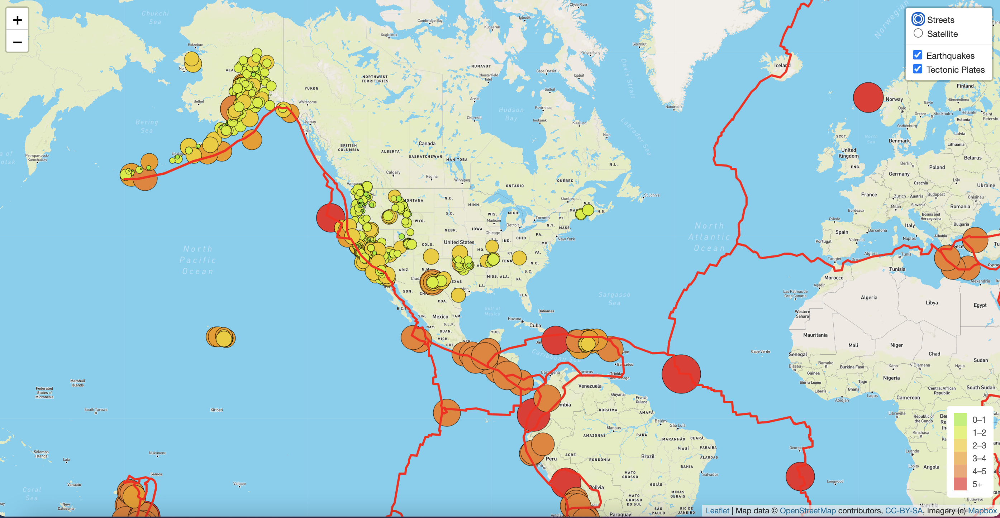
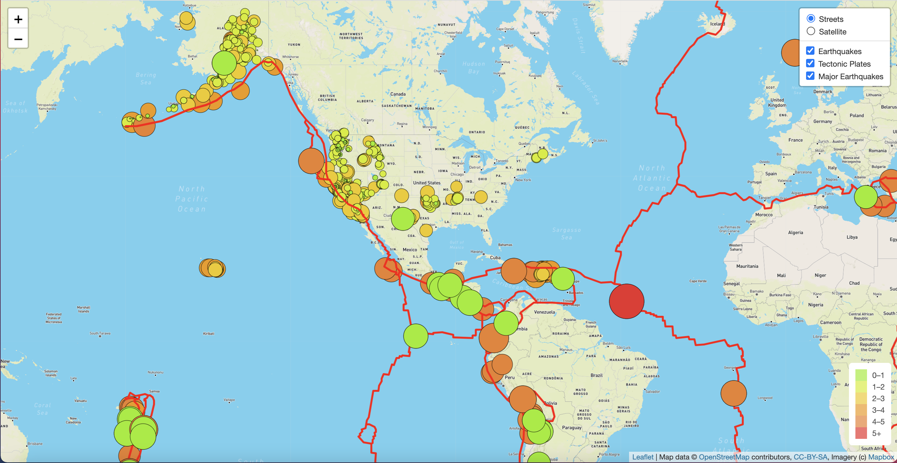
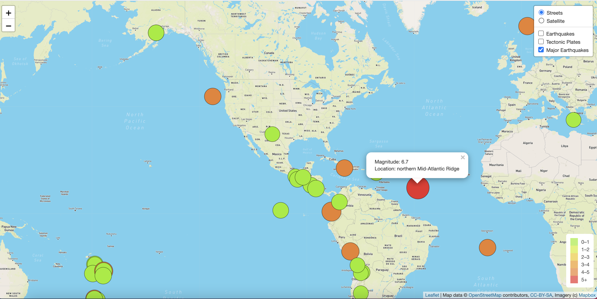
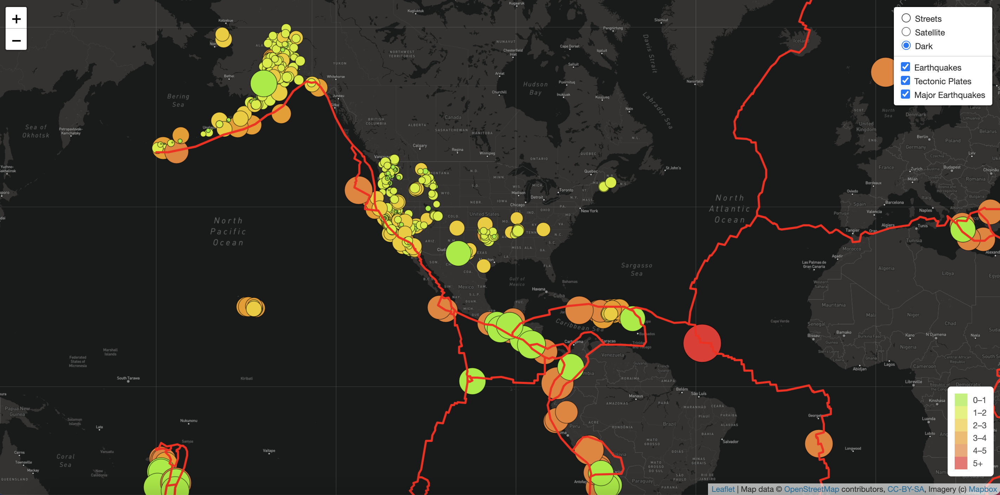

# Mapping_Earthquakes

## Purpose

This assignment consists of three technical analysis deliverables using knowledge of JavaScript, Leaflet.js, and geoJSON data. 

  - Deliverable 1: Add Tectonic Plate Data
  - Deliverable 2: Add Major Earthquake Data
  - Deliverable 3: Add an Additional Map

## Results

### Deliverable 1: Add Tectonic Plate Data

The earthquake data and tectonic plate data displayed on the map when the page loads.

 

### Deliverable 2: Add Major Earthquake Data

Add color and set the radius of the circle markers based on the magnitude of earthquake, and add a popup marker for each earthquake that displays the magnitude and location of the earthquake using the GeoJSON layer.

All the earthquake data and tectonic plate data are displayed on the map when the page loads and the datasets can be toggled on or off

 

The geoJSON() layer creates a circle for each major earthquake, and adds a popup for each circle to display the magnitude and location of the earthquake.

 

### Deliverable 3: Add an Additional Map

Add a third map style (dark) to your earthquake map.
All the earthquake data and tectonic plate data are displayed on the all maps of the webpage.

 
